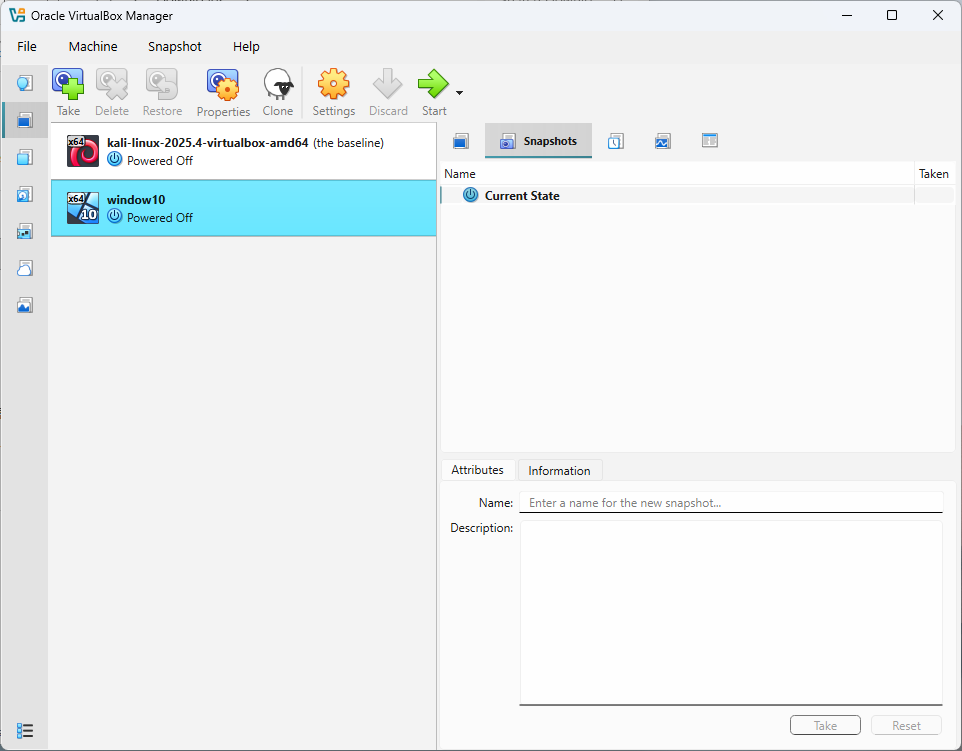
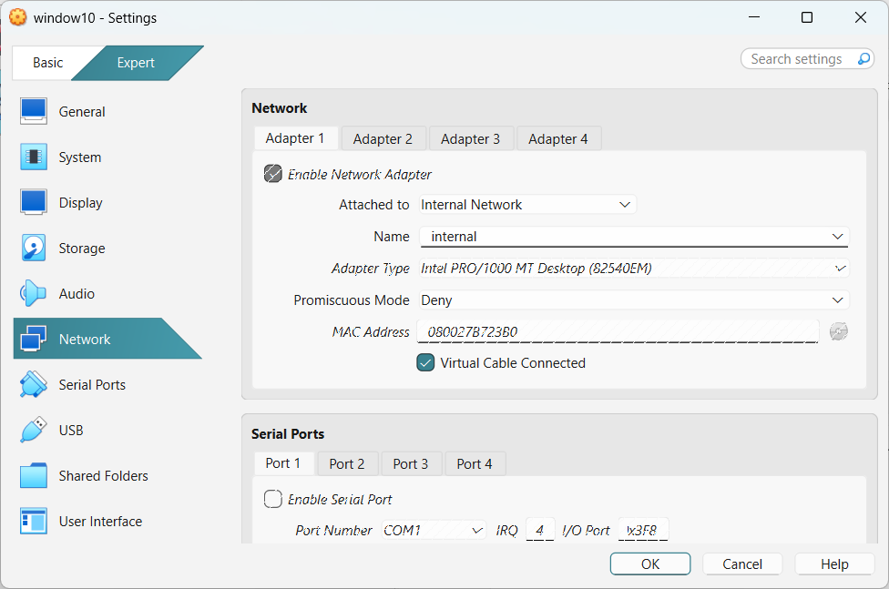
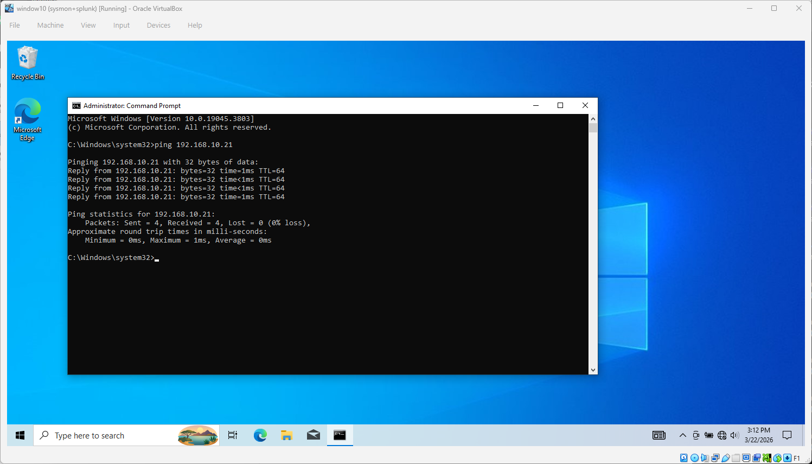
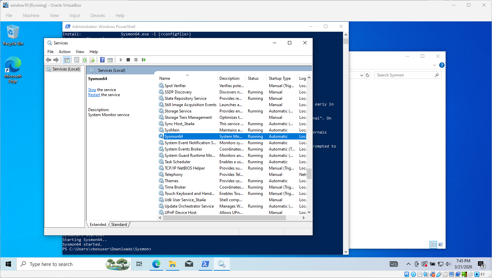
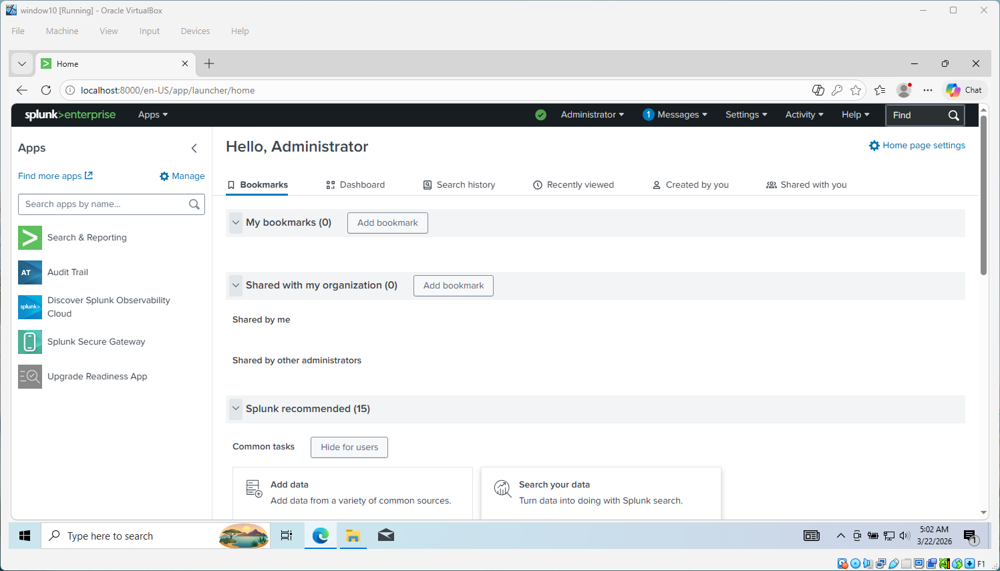

# SOC Homelab Setup

## Summary
This project documents a SOC homelab built to simulate endpoint monitoring and log analysis using Splunk and Sysmon.
This is Part 1 of Homelab Project. For detection-lab, see 👉 [splunk-detection-lab](https://github.com/ericnam-png/splunk-detection-lab)

## Overview
The lab includes a Windows-based environment, a SIEM solution (Splunk), and endpoint monitoring using Sysmon. It is designed to support security monitoring, log analysis, and attack simulation.

## Architecture
- Windows 10 (Target system)
- Kali Linux (Attacker machine)
- Splunk (SIEM)
- Sysmon (Endpoint monitoring)

## Environment
- VirtualBox
- Windows 10
- Kali Linux

## Setup Steps

### 1. Virtual Machine Setup
- Created Windows 10 and Kali Linux virtual machines using VirtualBox  
- Configured an isolated network to allow communication only between the machines  

### 2. Sysmon Deployment
- Installed Sysmon on the Windows system  
- Configured logging for process creation and system activity  

### 3. Splunk Installation
- Installed Splunk Enterprise on the Windows system  
- Configured log ingestion and data input  
- Enabled receiving logs from the endpoint  

## Key Capabilities
- Centralized log collection through Splunk  
- Endpoint visibility using Sysmon  
- Controlled environment for attack simulation and testing
- Visibility into process execution and system activity

## What I Learned
- How to build a basic SOC-like lab environment
- How internal networking setting isolates lab traffic
- Understanding of log pipelines and data ingestion  
- SIEM setup and integration with endpoints  
- Basic search queries to identify suspicious activity  

## Next Step
This environment is used for detection-focused projects, including:
- Brute-force attack detection  
- Remote command execution (RCE) detection  
- Log-based threat analysis

## Screenshots(5)

Virtual machines used in the homelab (Windows 10 and Kali Linux).

Internal network configuration to isolate lab traffic.

Successful communication between target machine and attacker.

Sysmon installed and running for endpoint visibility.

Splunk configured to ingest and display security logs.

## Reference
- [MyDFIR YouTube Channel](https://www.youtube.com/@MyDFIR)
